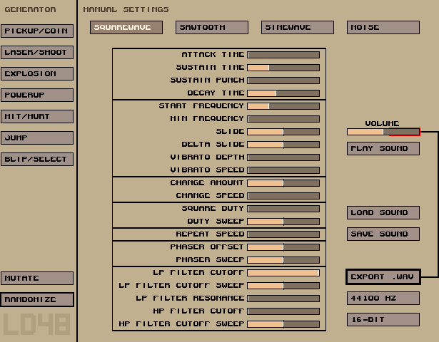

This is an unofficial SDL2 port of an official SDL1 linux version.

----------------------------
<http://www.drpetter.se/project_sfxr.html>

-----------------------------
sfxr - sound effect generator
-----------------------------
   by DrPetter, 2007-12-14
    developed for LD48#10
-----------------------------

Basic usage:

Start the application, then hit
some of the buttons on the left
side to generate random sounds
matching the button descriptions.

Press "Export .WAV" to save the
current sound as a WAV audio file.
Click the buttons below to change
WAV format in terms of bits per
sample and sample rate.

If you find a sound that is sort
of interesting but not quite what
you want, you can drag some sliders
around until it sounds better.

The Randomize button generates
something completely random.

Mutate slightly alters the current
parameters to automatically create
a variation of the sound.

Advanced usage:

Figure out what each slider does and
use them to adjust particular aspects
of the current sound...

Press the right mouse button on a slider
to reset it to a value of zero.

Press Space or Enter to play the current sound.

The Save/Load sound buttons allow saving
and loading of program parameters to work
on a sound over several sessions.

Volume setting is saved with the sound and
exported to WAV. If you increase it too much
there's a risk of clipping.

Some parameters influence the sound during
playback (particularly when using a non-zero
repeat speed), and dragging these sliders
can cause some interesting effects.
To record this you will need to use an external
recording application, for instance Audacity.
Set the recording source in that application
to "Wave", "Stereo Mix", "Mixed Output" or similar.

Using an external sound editor to capture and edit
sound can also be used to string several sounds
together for more complex results.

Parameter description:
- The top four buttons select base waveform
- First four parameters control the volume envelope
  Attack is the beginning of the sound,
  longer attack means a smoother start.
  Sustain is how long the volume is held constant
  before fading out.
  Increase Sustain Punch to cause a popping
  effect with increased (and falling) volume
  during the sustain phase.
  Decay is the fade-out time.
- Next six are for controlling the sound pitch or
  frequency.
  Start frequency is pretty obvious. Has a large
  impact on the overall sound.
  Min frequency represents a cutoff that stops all
  sound if it's passed during a downward slide.
  Slide sets the speed at which the frequency should
  be swept (up or down).
  Delta slide is the "slide of slide", or rate of change
  in the slide speed.
  Vibrato depth/speed makes for an oscillating
  frequency effect at various strengths and rates.
- Then we have two parameters for causing an abrupt
  change in pitch after a ceratin delay.
  Amount is pitch change (up or down)
  and Speed indicates time to wait before changing
  the pitch.
- Following those are two parameters specific to the
  squarewave waveform.
  The duty cycle of a square describes its shape
  in terms of how large the positive vs negative
  sections are. It can be swept up or down by
  changing the second parameter.
- Repeat speed, when not zero, causes the frequency
  and duty parameters to be reset at regular intervals
  while the envelope and filter continue unhindered.
  This can make for some interesting pulsating effects.
- Phaser offset overlays a delayed copy of the audio
  stream on top of itself, resulting in a kind of tight
  reverb or sci-fi effect.
  This parameter can also be swept like many others.
- Finally, the bottom five sliders control two filters
  which are applied after all other effects.
  The first one is a resonant lowpass filter which has
  a sweepable cutoff frequency.
  The other is a highpass filter which can be used to
  remove undesired low frequency hum in "light" sounds.

----------------------

License
-------

Basically, I don't care what you do with it, anything goes.

To please all the troublesome folks who request a formal license,
I attach the "MIT license" as follows:

--

Copyright (c) 2007 Tomas Pettersson

Permission is hereby granted, free of charge, to any person
obtaining a copy of this software and associated documentation
files (the "Software"), to deal in the Software without
restriction, including without limitation the rights to use,
copy, modify, merge, publish, distribute, sublicense, and/or sell
copies of the Software, and to permit persons to whom the
Software is furnished to do so, subject to the following
conditions:

The above copyright notice and this permission notice shall be
included in all copies or substantial portions of the Software.

THE SOFTWARE IS PROVIDED "AS IS", WITHOUT WARRANTY OF ANY KIND,
EXPRESS OR IMPLIED, INCLUDING BUT NOT LIMITED TO THE WARRANTIES
OF MERCHANTABILITY, FITNESS FOR A PARTICULAR PURPOSE AND
NONINFRINGEMENT. IN NO EVENT SHALL THE AUTHORS OR COPYRIGHT
HOLDERS BE LIABLE FOR ANY CLAIM, DAMAGES OR OTHER LIABILITY,
WHETHER IN AN ACTION OF CONTRACT, TORT OR OTHERWISE, ARISING
FROM, OUT OF OR IN CONNECTION WITH THE SOFTWARE OR THE USE OR
OTHER DEALINGS IN THE SOFTWARE.

----------------------

http://www.drpetter.se

  drpetter@gmail.com

----------------------
